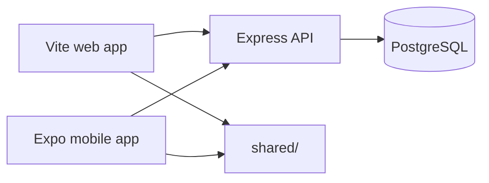

# Mobile ↔ Web sync

CourtTime uses **one Express API** and **PostgreSQL** for both clients. Shared logic lives under [`shared/`](../shared/).

## Architecture

## Shared modules (canonical)

| Module | Path |
|--------|------|
| Booking types | `shared/constants/bookingTypes.ts` |
| Bulletin display | `shared/utils/bulletinPostDisplay.ts` |
| Court availability | `shared/utils/courtAvailability.ts` |
| Strike lockout | `shared/utils/strikeLockout.ts` |
| API envelope | `shared/api/core.ts` |
| Domain contracts | `shared/types/contracts.ts` |

Web re-exports: `src/constants/bookingTypes.ts`, `src/utils/bulletinPostDisplay.ts`.

## Booking availability

Both clients use **`GET /api/court-config/:courtId/availability?date=YYYY-MM-DD`** for slot selection (web `BookingWizard`, `QuickReservePopup`; mobile Book tab).

Calendar grids still use facility bookings + `GET /api/court-config/facility/:facilityId?date=`.

## Strike / lockout UX

- **Web:** `CourtCalendarView` + `PlayerProfile` (per facility)
- **Mobile:** Home, Book, Profile (per facility)
- API: `GET /api/strikes/check/:userId?facilityId=`

Payment lockout (admin-imposed balance) is separate: `GET /api/members/me/payment-lockout` → HTTP 402.

## Notification preferences

Same API: `GET/PATCH /api/user-preferences/notifications`

- **Web profile:** email + mobile push toggles (push applies to the app only)
- **Mobile:** `notification-settings.tsx`

## Auth session refresh

| Client | Endpoint |
|--------|----------|
| Web | `GET /api/auth/me/:userId` |
| Mobile | `GET /api/auth/me` (Bearer JWT) |

## Intentional differences

| Feature | Web | Mobile |
|---------|-----|--------|
| Facility admin UI | Full admin console | Limited Admin tab |
| Facility registration | In-app | Opens web |
| Recurring bookings | Players with advanced booking | **Admin-only** on mobile |
| Push delivery | N/A | Expo push |
| Platform billing | Facility subscriptions | N/A |

## QA checklist

- [ ] Book free slot (web + mobile) — same slots for court/date
- [ ] Paid court Stripe return
- [ ] Bulletin paid signup
- [ ] Payment lockout paywall
- [ ] Strike lockout banner on calendar/book/profile
- [ ] Push pref off → no push (mobile)
- [ ] Reset password: valid + expired token (mobile validates first)
- [ ] Admin recurring series (mobile only)
