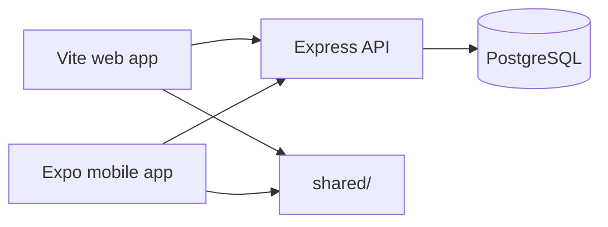

# Mobile ↔ Web sync

CourtTime uses **one Express API** and **PostgreSQL** for both clients. Shared logic lives under [`shared/`](../shared/).

## Architecture

```mermaid
flowchart LR
  Web[Vite web app]
  Mobile[Expo mobile app]
  API[Express API]
  DB[(PostgreSQL)]
  Shared[shared/]
  Web --> API
  Mobile --> API
  API --> DB
  Web --> Shared
  Mobile --> Shared
```

## Shared modules (canonical)

| Module | Path |
|--------|------|
| Booking types | `shared/constants/bookingTypes.ts` |
| Bulletin display | `shared/utils/bulletinPostDisplay.ts` |
| Court availability | `shared/utils/courtAvailability.ts` |
| Strike lockout | `shared/utils/strikeLockout.ts` |
| API envelope | `shared/api/core.ts` |
| Domain contracts | `shared/types/contracts.ts` |

Web re-exports: `src/constants/bookingTypes.ts`, `src/utils/bulletinPostDisplay.ts`.

## Booking availability

Both clients use **`GET /api/court-config/:courtId/availability?date=YYYY-MM-DD`** for slot selection (web `BookingWizard`, `QuickReservePopup`; mobile Book tab).

Calendar grids still use facility bookings + `GET /api/court-config/facility/:facilityId?date=`.

## Strike / lockout UX

- **Web:** `CourtCalendarView` + `PlayerProfile` (per facility)
- **Mobile:** Home, Book, Profile (per facility)
- API: `GET /api/strikes/check/:userId?facilityId=`

Payment lockout (admin-imposed balance) is separate: `GET /api/members/me/payment-lockout` → HTTP 402.

## Feature flags

Keys are defined once in `shared/constants/featureFlags.ts` — import `FEATURE_FLAGS`, never re-type the strings. Both clients read the same endpoint:

**`GET /api/facilities/:id/feature-flags`** → `{ success, data: string[] }` (enabled keys only).

| Client | Holder | Notes |
|--------|--------|-------|
| Web | `AppContext` (`enabledFeatures`, `featuresLoaded`) | Gates `UnifiedSidebar` nav |
| Mobile | `FeatureFlagContext` (`useFeatureFlags()`) | Resolves per selected facility |

Mobile resolution order, in priority:

1. A successful fetch for the selected facility.
2. The last known good set from cache — **including when stale**. Flags decide which screens exist, so expiring them offline would strip features from a member mid-session. This is why they use `getStaleCachedData` rather than the TTL-respecting cache readers.
3. Nothing enabled. **Flags fail closed:** with no successful read ever recorded for a facility, every flagged feature stays hidden. Showing a feature a facility has not enabled is worse than hiding one it has — the server rejects the calls behind it anyway.

Mobile re-resolves on login, on facility switch, and on app foreground (an admin can enable a feature while the member has the app backgrounded). A slow response for a facility the member has already left is discarded rather than applied.

`flagsLoaded` is false until the first attempt settles — gate flagged entry points on it so they don't appear and then vanish.

## Notification preferences

Same API: `GET/PATCH /api/user-preferences/notifications`

- **Web profile:** email + mobile push toggles (push applies to the app only)
- **Mobile:** `notification-settings.tsx`

## Auth session refresh

| Client | Endpoint |
|--------|----------|
| Web | `GET /api/auth/me/:userId` |
| Mobile | `GET /api/auth/me` (Bearer JWT) |

## Intentional differences

| Feature | Web | Mobile |
|---------|-----|--------|
| Facility admin UI | Full admin console | Limited Admin tab |
| Facility registration | In-app | Opens web |
| Recurring bookings | Players with advanced booking | **Admin-only** on mobile |
| Push delivery | N/A | Expo push |
| Platform billing | Facility subscriptions | N/A |

## QA checklist

- [ ] Book free slot (web + mobile) — same slots for court/date
- [ ] Paid court Stripe return
- [ ] Bulletin paid signup
- [ ] Payment lockout paywall
- [ ] Strike lockout banner on calendar/book/profile
- [ ] Push pref off → no push (mobile)
- [ ] Reset password: valid + expired token (mobile validates first)
- [ ] Admin recurring series (mobile only)
- [ ] Flag on/off parity: a flagged feature shows on both clients for the same facility
- [ ] Multi-facility switch between a flag-on and a flag-off club mid-session
- [ ] Mobile offline: cached flags survive; a never-fetched facility shows no flagged features
