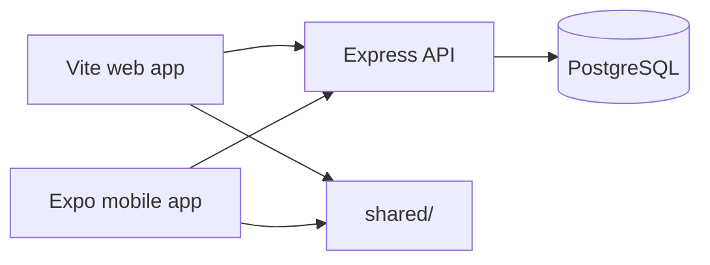

# Mobile ↔ Web sync

CourtTime uses **one Express API** and **PostgreSQL** for both clients. Shared logic lives under [`shared/`](../shared/).

## Architecture

```mermaid
flowchart LR
  Web[Vite web app]
  Mobile[Expo mobile app]
  API[Express API]
  DB[(PostgreSQL)]
  Shared[shared/]
  Web --> API
  Mobile --> API
  API --> DB
  Web --> Shared
  Mobile --> Shared
```

## Shared modules (canonical)

| Module | Path |
|--------|------|
| Booking types | `shared/constants/bookingTypes.ts` |
| Bulletin display | `shared/utils/bulletinPostDisplay.ts` |
| Court availability | `shared/utils/courtAvailability.ts` |
| Strike lockout | `shared/utils/strikeLockout.ts` |
| API envelope | `shared/api/core.ts` |
| Domain contracts | `shared/types/contracts.ts` |
| Feature flag keys | `shared/constants/featureFlags.ts` |
| Blackout → blocked ranges | `shared/utils/blackoutSlots.ts` |
| Court type filter + peak slots | `shared/utils/courtTypeFilter.ts` |
| Schedule overview + time labels | `shared/utils/scheduleOverview.ts` |
| Stripe return URLs for mobile | `shared/utils/mobileCheckoutUrls.ts` |
| Money parsing/formatting | `shared/utils/money.ts` |

Web re-exports: `src/constants/bookingTypes.ts`, `src/utils/bulletinPostDisplay.ts`.

## Booking availability

Both clients use **`GET /api/court-config/:courtId/availability?date=YYYY-MM-DD`** for slot selection (web `BookingWizard`, `QuickReservePopup`; mobile Book tab).

Calendar grids still use facility bookings + `GET /api/court-config/facility/:facilityId?date=`.

## Strike / lockout UX

- **Web:** `CourtCalendarView` + `PlayerProfile` (per facility)
- **Mobile:** Home, Book, Profile (per facility)
- API: `GET /api/strikes/check/:userId?facilityId=`

Payment lockout (admin-imposed balance) is separate: `GET /api/members/me/payment-lockout` → HTTP 402.

## Feature flags

Keys are defined once in `shared/constants/featureFlags.ts` — import `FEATURE_FLAGS`, never re-type the strings. Both clients read the same endpoint:

**`GET /api/facilities/:id/feature-flags`** → `{ success, data: string[] }` (enabled keys only).

| Client | Holder | Notes |
|--------|--------|-------|
| Web | `AppContext` (`enabledFeatures`, `featuresLoaded`) | Gates `UnifiedSidebar` nav |
| Mobile | `FeatureFlagContext` (`useFeatureFlags()`) | Resolves per selected facility |

Mobile resolution order, in priority:

1. A successful fetch for the selected facility.
2. The last known good set from cache — **including when stale**. Flags decide which screens exist, so expiring them offline would strip features from a member mid-session. This is why they use `getStaleCachedData` rather than the TTL-respecting cache readers.
3. Nothing enabled. **Flags fail closed:** with no successful read ever recorded for a facility, every flagged feature stays hidden. Showing a feature a facility has not enabled is worse than hiding one it has — the server rejects the calls behind it anyway.

Mobile re-resolves on login, on facility switch, and on app foreground (an admin can enable a feature while the member has the app backgrounded). A slow response for a facility the member has already left is discarded rather than applied.

`flagsLoaded` is false until the first attempt settles — gate flagged entry points on it so they don't appear and then vanish.

## Flagged feature screens

Five flagged features have a mobile screen, reached from the **More** tab. That tab only appears when the selected facility has at least one of them on, so a club with none never sees it.

| Feature | Flag | Mobile screen | Web |
|---------|------|---------------|-----|
| Pro Shop | `pro_shop` | `app/pro-shop.tsx` | `/shop` |
| Lessons | `lessons_tab` | `app/lessons.tsx` | `/lessons` |
| Padel | `padel` | `app/padel.tsx` | `/padel` |
| Ball machine passes | `st_marlow_ball_machine` | `app/ball-machine.tsx` | `/ball-machine` |
| My Player Group | `player_level_groups` | `app/level-group.tsx` | `MyLevelGroup` |

Menu contents live in `mobile/src/utils/moreMenu.ts` — add a feature there, not in the tab layout.

## Notification preferences

Same API: `GET/PATCH /api/user-preferences/notifications`

- **Web profile:** email + mobile push toggles (push applies to the app only)
- **Mobile:** `notification-settings.tsx`

## Auth session refresh

| Client | Endpoint |
|--------|----------|
| Web | `GET /api/auth/me/:userId` |
| Mobile | `GET /api/auth/me` (Bearer JWT) |

## Intentional differences

| Feature | Web | Mobile |
|---------|-----|--------|
| Facility registration | In-app wizard with Stripe | Opens web (`register-facility` screen links out) |
| Recurring bookings | Players with advanced booking | **Admin-only** on mobile |
| Push delivery | N/A | Expo push |
| Platform billing (facility subscription) | Full BillingTab with promo codes | Subscription status, billing history, portal and checkout open in the browser (`admin/payments`) |
| Rich-text editors (general rules, terms) | TipTap editor with headings/bold | Plain-text editor; paragraphs and `- ` bullets become simple HTML on publish. The screen links to the web editor for rich formatting |
| Email template preview | Rendered HTML preview | Subject/body editing only; the body is shown as text |
| Household self-service | `householdsApi` wrappers exist but nothing on the web calls them | Admin Households screen reads the admin endpoint |

Everything else in the admin console (bookings and series, members, courts, facility, lessons, payments, dashboard analytics, households, reports, ball machine, booking rules, pro shop, annual fees, club policies) and every player feature (reservations, split payments, settlement close-out for staff, open spots, bulletin, lessons, padel organising and scoring, pro shop, notifications, messaging incl. groups, player groups, quick reserve, invites) is native on mobile.

## Web-only API paths

`npm run parity:check` (also run in CI) extracts every `/api/...` path used by `src/` and by `mobile/`, and fails when the web calls a path that mobile does not, unless it is listed here. Dynamic segments are normalised to `:id`; an entry ending in `*` covers a prefix. Remove an entry when the mobile screen lands (the script prints stale entries).

| Path | Why web-only |
|------|--------------|
| `/api/facilities` | Web `AdminBooking` lists all facilities then filters to the admin's; mobile uses the header facility selector |
| `/api/payments/create-checkout-session`, `/api/payments/validate-promo`, `/api/payments/verify-session`, `/api/payments/sync-setup-session`, `/api/payments/court-add/confirm` | Facility registration wizard, platform-billing promo codes and Stripe browser-return handlers. Mobile opens these flows on the web, and Stripe returns to the app via deep links instead |
| `/api/admin/email-templates/:id/:id/preview` | Rendered HTML preview; mobile edits subject/body and shows the body as text |
| `/api/notifications` | Web `NotificationContext` persists client-generated toasts; mobile notifications are created server-side |
| `/api/player-profile/:id/bookings` | Web profile lists bookings from the profile endpoint; mobile uses `/api/bookings/upcoming/:id` and My Reservations |
| `/api/address-whitelist/:id/check/:id`, `/api/address-whitelist/:id/count/:id`, `/api/auth/add-facility`, `/api/users/:id/memberships`, `/api/members/:id/:id/is-admin`, `/api/hitting-partner/user/:id`, `/api/strikes/:id`, `/api/households/*` | Wrapper functions in `src/api/client.ts` with no web caller (dead API surface); nothing to mirror |

## QA checklist

- [ ] Book free slot (web + mobile) — same slots for court/date
- [ ] Paid court Stripe return
- [ ] Bulletin paid signup
- [ ] Payment lockout paywall
- [ ] Strike lockout banner on calendar/book/profile
- [ ] Push pref off → no push (mobile)
- [ ] Reset password: valid + expired token (mobile validates first)
- [ ] Admin recurring series (mobile only)
- [ ] Flag on/off parity: a flagged feature shows on both clients for the same facility
- [ ] Multi-facility switch between a flag-on and a flag-off club mid-session
- [ ] Mobile offline: cached flags survive; a never-fetched facility shows no flagged features
- [ ] More tab appears only when a flagged feature is on, and lists exactly those
- [ ] Ball machine: pass purchase returns from Stripe and the pass shows active; access code appears only after paying
- [ ] Pro shop: basket respects stock, checkout returns from Stripe
- [ ] Padel: join, leave, and a full session refusing a join; organiser creates a session, starts a round and records a score on mobile
- [ ] Split payment: pay / decline a share from the reservation sheet, organiser edits who's splitting
- [ ] Staff close-out: admin closes out a post-play booking, a failed charge can be marked cash or waived
- [ ] Admin parity: each Admin tab entry opens, loads real data for the selected facility, and a write (e.g. toggling a booking rule) shows on the web after refresh
- [ ] `npm run parity:check` passes and every listed web-only path still has a reason
